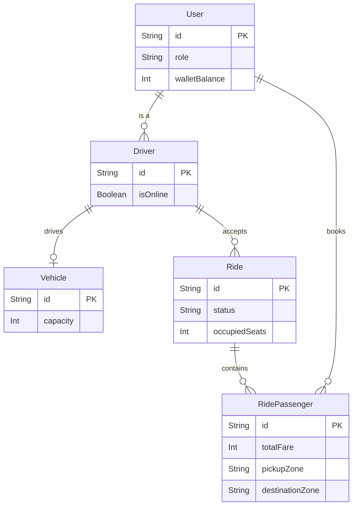

# Dhaka Tesla Pool

This is a full-stack project for the Dhaka Tesla Pool internship challenge. It is built using NestJS, Next.js, and PostgreSQL. The application allows passengers to book seats in a shared car, splits the fare when they pool, and helps drivers manage the trips while making sure the car's capacity is never exceeded.

## Features
- Ride Pooling Logic: Matches passengers based on route and automatically updates the fare.
- Seat Limit Checking: Ensures the car's 3 seats are not overbooked by handling database concurrency.
- User Dashboards: Separate views and controls for Drivers (Jashim) and Passengers (Nusrat, Rafiq, Shirin).
- Ride Status: Follows a strict flow from Requested to Matched, Arrived, Started, and Completed.

## Tech Stack
- Frontend: Next.js (App Router), Tailwind CSS, Axios
- Backend: NestJS, Prisma ORM, JWT authentication, bcrypt
- Database: PostgreSQL (using Docker)

## Database Structure


## Local Setup Guide

### Prerequisites
- Node.js installed
- Docker Desktop running

### 1. Start the Database
Run this command in the main folder to start PostgreSQL:
```bash
docker compose up -d postgres
```

### 2. Environment Variables
Copy the `.env.example` file into the `backend/` folder and name it `.env`:
```bash
cp .env.example backend/.env
```

### 3. Backend Setup
Open a terminal in the backend folder and run:
```bash
cd backend
npm install
npx prisma generate
npx prisma db push
npm run seed
npm run start:dev
```
(The seed command automatically creates the accounts for Jashim, Nusrat, Rafiq, and Shirin).

### 4. Frontend Setup
Open a second terminal in the frontend folder and run:
```bash
cd frontend
npm install
npm run dev
```
The website will now be running at http://localhost:3000.

## Demo Accounts
You can log in using these seeded test accounts:
- Driver: jashim@tesla.com / jashim123
- Passenger 1: nusrat@pool.com / nusrat123
- Passenger 2: rafiq@pool.com / rafiq123
- Passenger 3: shirin@pool.com / shirin123

## How Concurrency is Handled (The Shirin Problem)
If the car only has 1 seat left, and two passengers try to book it at the exact same millisecond, the system needs to prevent an overbooking. To solve this, I used Prisma's `$transaction` feature. 
When a booking happens, the backend checks `capacity - occupiedSeats >= requestedSeats` and updates the count inside a single transaction block. If someone else takes the seat first, the transaction catches it and throws a Bad Request error. 
If the app gets much larger, this database lock could cause slowdowns. A better solution for a huge app would be to use a message queue (like RabbitMQ) to process bookings one by one.

## Scaling for 1 Million Users
If this app goes viral in Dhaka, the current setup would face performance issues. Here is how I would scale it:
- Load Balancing: Run multiple backend servers instead of just one to handle more traffic.
- Database Reads: Add Read Replicas to PostgreSQL so that looking at ride history doesn't slow down the main database handling the bookings.
- Location Matching: Checking standard database rows for nearby rides is too slow for 1 million users. I would add Redis to quickly search for rides in the same area.
- Real-time Updates: Right now the app relies on refreshing data. I would add WebSockets (Socket.io) so drivers and passengers get instant live updates.

## AI Usage
I used AI tools to help speed up writing some of the basic boilerplate code (like Next.js UI setup, basic Tailwind styling, and generating the Prisma schema file). However, all the core logic, such as the pooling math, transaction handling, and ride status rules, were manually written and tested to ensure they work properly for the assignment.

## Demo Video
[[Insert Loom Video Link Here](https://www.loom.com/share/d0791db5443741838d95ff7a5f3546ad)]
