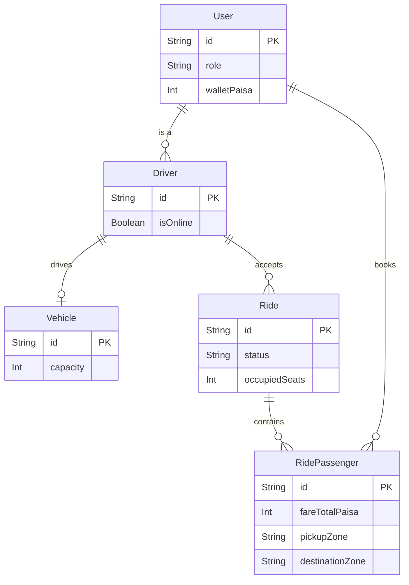

# Dhaka Tesla Pool 🚗⚡

Share a seat. Split the fare. Survive Dhaka traffic.

This is a full-stack MVP for the "Dhaka Tesla Pool" challenge, built with **NestJS**, **Next.js**, and **PostgreSQL**. It allows passengers to book seats in a shared "Tesla", calculates fares dynamically based on pooling, and lets drivers manage the trip lifecycle while enforcing strict seat capacities.

---

## 🎯 Core Features
*   **Smart Pooling Engine:** Matches passengers based on route compatibility and automatically splits the fare.
*   **Strict Capacity Enforcement:** Ensures Bullet's 3 seats are never overbooked, using database-level transaction concurrency safety.
*   **Role-Based Dashboards:** Isolated workflows for Drivers (Jashim) and Passengers (Nusrat, Rafiq, Shirin).
*   **State Machine:** Enforces valid ride lifecycles (`REQUESTED` → `MATCHED` → `DRIVER_ARRIVED` → `STARTED` → `COMPLETED`).
*   **Paisa Math:** Fares are calculated entirely in integer *paisa/poysha* to avoid floating-point inaccuracies.

---

## 🏗️ Architecture & Database

**Tech Stack:**
*   **Frontend:** Next.js 14 (App Router), Tailwind CSS, Axios
*   **Backend:** NestJS, Prisma ORM, JWT, bcrypt
*   **Database:** PostgreSQL 16 (Dockerized)

### Database ERD


---

## 🚀 Local Setup & Installation

### Prerequisites
*   Node.js (v20+)
*   Docker Desktop (Running)

### 1. Start the Database
The project uses Docker Compose to easily spin up PostgreSQL.
```bash
docker compose up -d postgres
```

### 2. Environment Variables
An `.env.example` file is provided in the root directory. Copy it to `.env` in the `backend/` directory:
```bash
cp .env.example backend/.env
```

### 3. Backend Setup & Seeding
```bash
cd backend
npm install
npx prisma generate
npx prisma db push
npm run seed
npm run start:dev
```
*(The seed command injects the required story cast: Jashim, Nusrat, Rafiq, Shirin).*

### 4. Frontend Setup
In a new terminal tab:
```bash
cd frontend
npm install
npm run dev
```
The app will be available at `http://localhost:3000`.

---

## 🧪 Demo Credentials
You can log in to the UI using the seed data:
*   **Driver:** `jashim@tesla.com` / `jashim123`
*   **Passenger 1:** `nusrat@pool.com` / `nusrat123`
*   **Passenger 2:** `rafiq@pool.com` / `rafiq123`
*   **Passenger 3:** `shirin@pool.com` / `shirin123`

---

## 🧠 Handling Concurrency (The "Shirin" Problem)
If Bullet has exactly 1 seat left, and Nusrat and Shirin try to book it at the exact same millisecond, we must prevent overbooking.
**Current Solution (MVP):** We use Prisma's `$transaction` with optimistic capacity checking. The `RidesService` locks the ride state in a transaction, verifies `capacity - occupiedSeats >= requestedSeats`, and immediately increments the `occupiedSeats` integer before completing the passenger creation. If the check fails during the transaction, it rolls back and returns a `400 Bad Request`.
**Future Scale:** At 100k+ users, this DB lock would cause contention. We would migrate this to a Redis-backed distributed lock or a message queue (like RabbitMQ) to serialize booking requests per vehicle.

---

## 📈 Scaling to "Oi Tesla Goes Viral" (1M Users)
If the app blows up in Dhaka, our MVP architecture will bottleneck at the Postgres read/write level and matching algorithm.
*   **Horizontal Scaling:** Run multiple instances of the NestJS API behind an AWS ALB or Nginx load balancer.
*   **Database:** Implement Postgres Read Replicas for driver profile/history reads, keeping the Primary DB dedicated to write-heavy transactions (booking/capacity locking).
*   **Matching Engine:** The current SQL query matching is too slow for 1M users. We would implement **Redis Geospatial Indexes (GeoHash)** to find nearby compatible rides in `O(log(N))` time.
*   **Real-time:** Replace simple polling with WebSockets (Socket.io) or Server-Sent Events (SSE) for instant driver location and ride status updates.

---

## 🤖 AI Usage
AI tools (GitHub Copilot / Deepmind Assistant) were used strictly as an accelerator for:
*   Generating boilerplate Next.js UI components and Tailwind layouts quickly.
*   Drafting the Prisma Schema syntax based on the planned ERD.
*   Automating the JWT auth scaffolding in NestJS.
Core business logic (the pooling math, transaction safety, and state machine constraints) was heavily reviewed and manually designed to meet the exact PRD requirements.

---

## 🎥 Demo Video
[Insert Loom Video Link Here]
